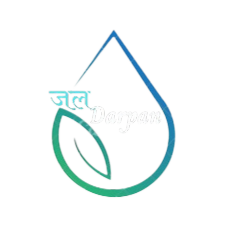

# 💧 Water-Prediction: Water Footprint Awareness & Prediction Platform



## 🌱 Project Overview

Water-Prediction is a web platform dedicated to raising awareness about water footprints and providing actionable solutions for effective water management. The platform educates users on the environmental impact of their water usage, empowers them to make informed choices, and offers personalized strategies for reducing water consumption. It features a machine learning-powered calculator to predict water usage for different crops based on environmental conditions.

---

## 🚀 Features

- **Awareness Hub:** Educational content, tips, and videos on saving water and energy.
- **Water Usage Calculator:** Predicts water usage based on temperature, humidity, soil moisture, rainfall, and crop type using a machine learning model.
- **Analysis & Visualization:** Interactive charts and data visualizations for water footprint analysis.
- **FAQs:** Answers to common questions about water management and agriculture.
- **ML Model Backend:** Flask API for real-time water usage prediction.

---

## 🛠️ Tech Stack

- **Frontend:** HTML, CSS, JavaScript
- **Backend:** Python (Flask, Flask-CORS)
- **Machine Learning:** scikit-learn, pandas, joblib
- **Visualization:** AnyChart
- **Data:** CSV files for model training and prediction

---

## 📂 Directory Structure

```
Water-Prediction/
├── Water/                # Main website files and assets
├── project1/             # Subpages: About, Awareness, Calculator, Analysis, FAQs, etc.
├── ML Model/             # Machine learning scripts, model, and API
├── Images/               # Project images and logos
└── README.md             # Project documentation
```

---

## ⚡ Getting Started

### 1. Frontend

- Open `Water/index - Copy.html` in your browser to explore the platform.

### 2. Backend (ML Model)

- Navigate to the `ML Model/` directory.
- Install dependencies:
  ```bash
  pip install flask flask-cors pandas scikit-learn joblib
  ```
- Run the Flask app:
  ```bash
  python app.py
  ```
- The calculator will send POST requests to `http://127.0.0.1:5000/predict` for water usage prediction.

---

## 🔬 Machine Learning Model

- **Model Type:** Random Forest Regressor
- **Features Used:**
  - Temperature (°C)
  - Humidity (%)
  - Soil Moisture (%)
  - Rainfall (mm)
  - Crop Type (one of: Wheat, Rice, Soybean, Maize; one-hot encoded)
- **Target:** Water Usage (liters)
- **Training Data:** See `ML Model/sample_data.csv`
- **Model Artifacts:** `water_prediction_model.pkl`, `feature_columns.pkl`

### Example API Request

**Endpoint:** `POST /predict`  
**Request Body:**
```json
{
  "temperature": 25,
  "humidity": 60,
  "soil_moisture": 30,
  "rainfall": 10,
  "crop_type": "wheat"
}
```
**Response:**
```json
{
  "predicted_water_usage": 320.5
}
```

---

## 🖼️ Screenshots

Add screenshots from the `Images/` directory here to showcase the UI and features.

---

## 📖 Subpages & Features

- **About Us:** Meet the team and learn about the project's mission.
- **Awareness:** Tips, infographics, and a video on water conservation.
- **Calculator:** Enter environmental and crop data to predict water usage.
- **Analysis:** Visualize water footprint data with interactive charts.
- **FAQs:** Find answers to common agricultural and water management questions.

---

## 👥 Credits

Developed by a team of passionate web developers and designers.  
(See `project1/About/about us.html` for team details.)

---

## 🤝 Contributing

Contributions are welcome! Please open an issue or submit a pull request for suggestions or improvements.

---

## 📬 Contact

For questions, suggestions, or contributions, please open an issue or contact the project maintainers.

---

> © 2023 Water-Prediction | All Rights Reserved
